# 实践项目
## AI食堂Agent挑战

在大语言模型快速发展的今天，AI已经不再只是一个会聊天、会回答问题的工具。真正有趣的问题是：如果给大语言模型配上工具、目标、记忆和反馈，它能不能像一个“智能体”一样完成任务？

在本项目中，你将经营一个校园食堂窗口。你是窗口老板，大语言模型（LargeLanguageModel,LLM）是你的厨师，顾客会不断提出点餐需求，而你需要在有限预算内为厨师购买合适的厨具。不同厨具对应不同的工具（Tools），例如平底锅用于煎制，烤箱用于烘烤，蒸笼用于蒸制。厨师接到订单后，会先进行规划（Planning），再调用工具执行行动（Actions），并根据工具返回的观察结果（Observations）判断菜品是否完成。如果缺少工具，帮厨会作为检查器（Evaluator）指出问题，并促使厨师重新规划（Re-planning）。

每位顾客都会根据最终菜品给出评分（Reward）和评价，这些订单记录、评分和评论会被保存为记忆（Memory）。每天打烊后，你可以查看评论区，分析大家喜欢什么菜、哪些工具最值得购买、哪些问题导致评分下降，并在下一天调整窗口配置，争取获得更高的店铺口碑（Reputation）。

# 阿里云百炼API获取指南

## 1.阿里云百炼

本项目推荐使用阿里云百炼提供的、带有免费额度的API。

网址：[https://bailian.console.aliyun.com/](https://bailian.console.aliyun.com/)

进入网站后，完成注册并登录。


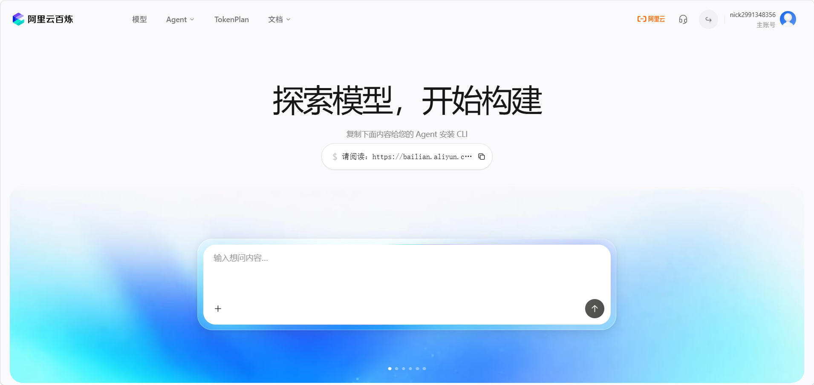{width=85%}


##2.模型连接配置

完成本项目需要配置以下三个参数：

-BaseURL
-OpenAIAPIKey
-Model


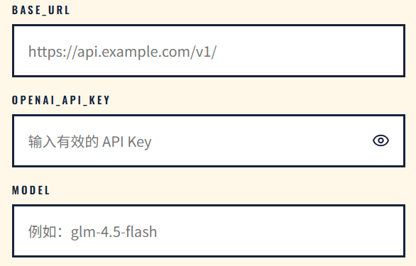{width=85%}


下面分别说明三个参数的获取方式。

---

## 3.Model

进入模型相关页面。


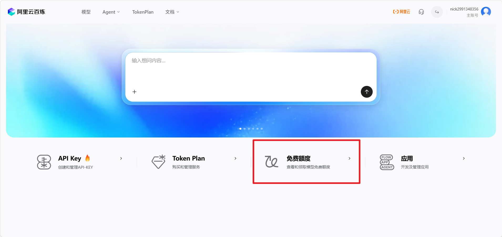{width=85%}


>本人很早以前使用过，已经忘记是否需要手动领取模型。如果账号中已经可以直接使用，就无需额外领取。


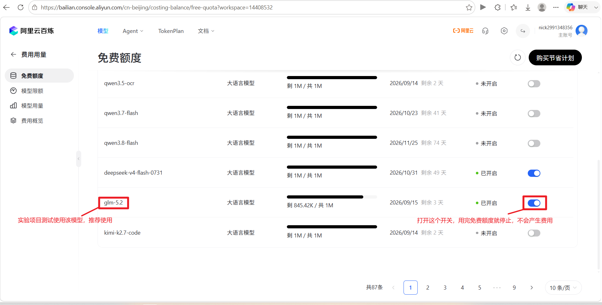{width=85%}


页面中显示的模型名称，就是配置中的`Model`值。

推荐测试时使用：

```text
glm-5.2
```

如果没有`glm-5.2`，换用其他纯文本模型也可以。

其他模型可以自行体验。

名字中带有`ocr`、`image`、`video`等字样的模型没有必要使用，本项目使用普通的纯文本语言模型即可。

---

## 4.创建APIKey

进入APIKey管理页面。


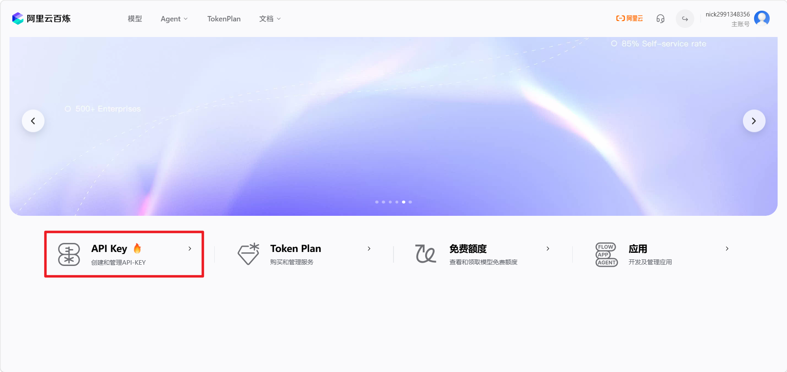{width=85%}


按照页面提示创建新的APIKey。


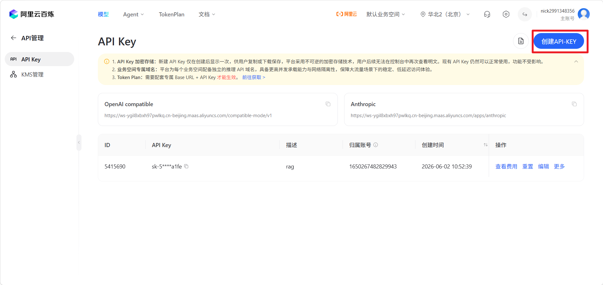{width=85%}


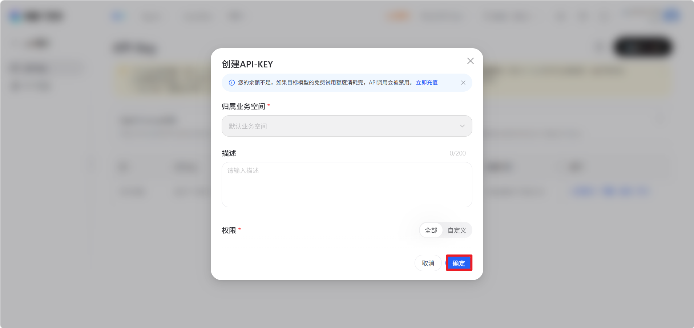{width=85%}


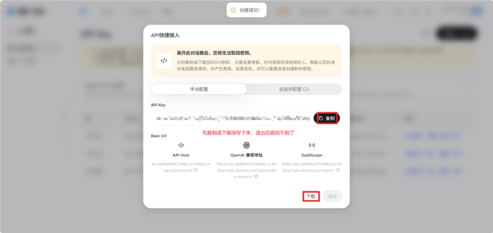{width=85%}


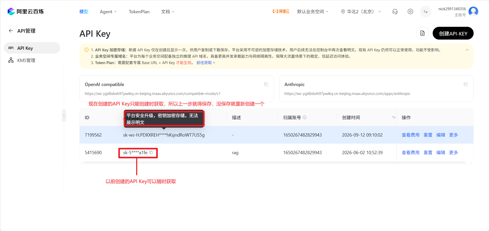{width=85%}


这里得到的Key，就是项目配置中需要填写的：

```text
OpenAIAPIKey
```

>**注意：不要在公共场合泄漏自己的APIKey。**

如果APIKey被其他人获取，对方可能会消耗你的API调用额度。

为了降低泄漏风险，建议在完成项目之后禁用或删除用于本次项目的APIKey。


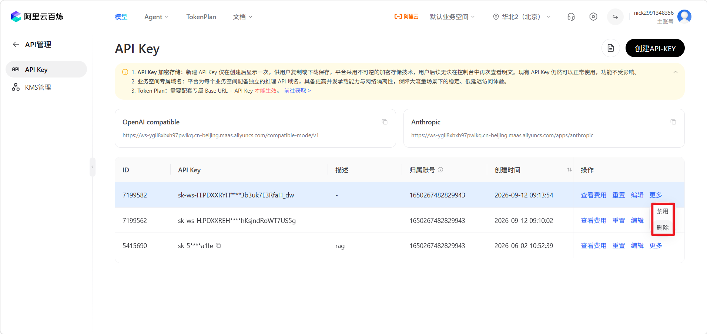{width=85%}


---

## 5.BaseURL

进入API调用相关页面，找到OpenAI兼容接口对应的地址。


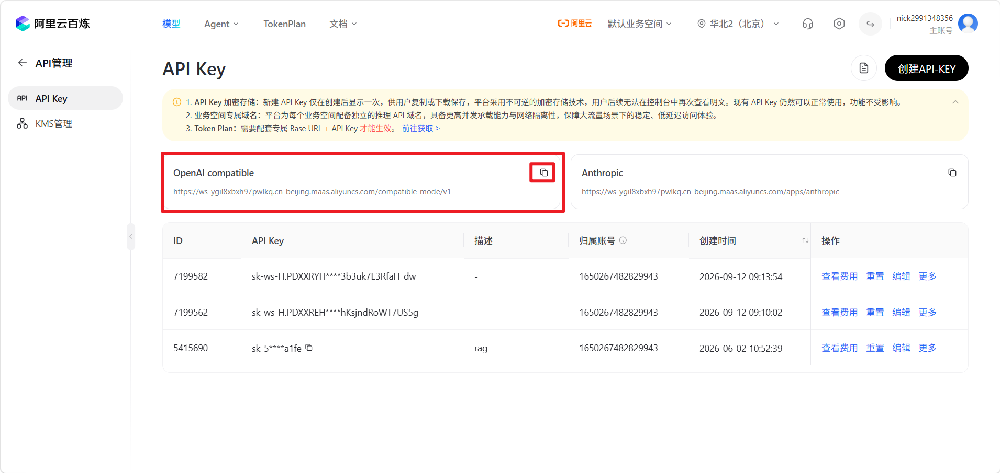{width=85%}


图中框选的地址就是：

```text
BaseURL
```

将它填写到项目对应的配置项中即可。

---

## 6.开始项目

获取以下三项信息后：

-`BaseURL`
-`OpenAIAPIKey`
-`Model`

就可以正式开始项目。

项目地址：

[https://47.122.122.241](https://47.122.122.241)

**祝你好运！**

---

## 7.项目提交

本项目承诺不主动持久化APIKey，并尽可能减少Key的暴露面。
完成项目后，请提交以下信息：

```text
通过本项目对agent的理解，经营三天结束后的截图，姓名
```

发送至：

```text
msc_official@outlook.com
```
