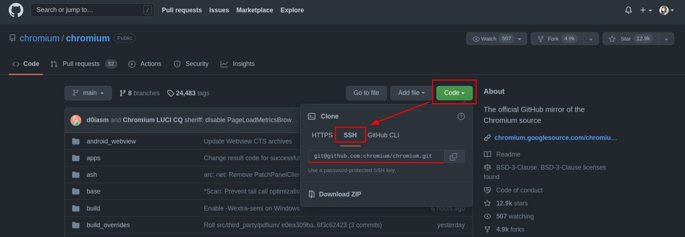
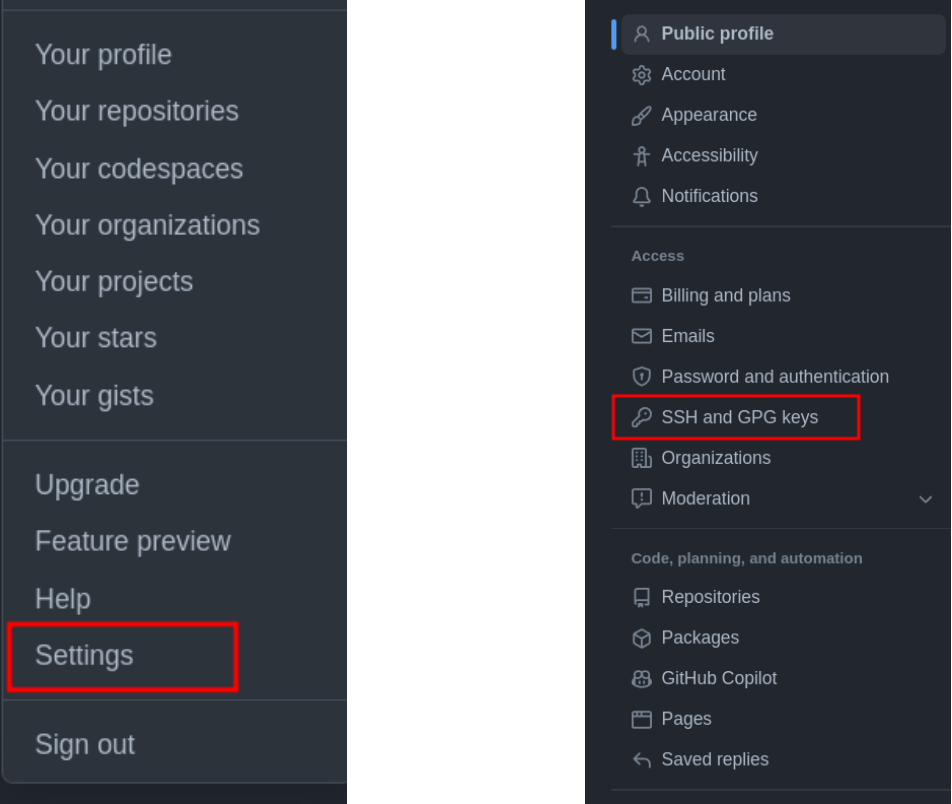
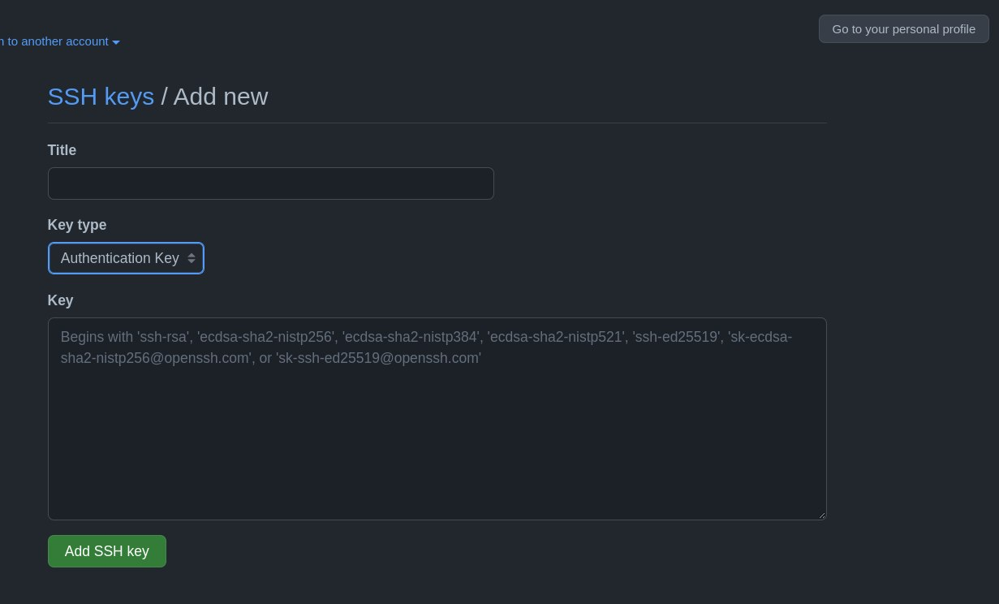

# Github 简介

## git

> 本节可以与 https://www.atlassian.com/git/tutorials/what-is-version-control 一起食用

git 和 github 是完全不同的两个东西，但二者之间有所关联。

git 是一个开源的版本控制工具。

github 是一个远程代码托管平台。

### 本地仓库
git 以“仓库”为基本管理单元，仓库可以认为就是一个文件夹。

`git init` 命令能将当前目录变成一个 git 仓库，生成仓库的描述信息，
这些信息以特定格式储存在 .git 文件夹中。

对于文件夹内文件也就是仓库内文件的状态，可以用 git 相关命令得知。

修改文件后，可以使用 `git add <filename/directory>` 来对文件进行跟踪，
使用 `git commit` 来将所有跟踪的修改进行提交。

??? note 
    命令行下的格式描述:

    一般来说，不带括号的即为命令本身，也是固定部分，例如 `git add`。

    而带有括号的内容则是可变部分，其中 `<>` 的内容为不可缺省，`[]` 包含的内容为可缺省。

    上文中 `git add` 不能变化，而 `<filename/directory>` 则是用你想要 add 的文件的文件名或者目录名称来进行替换，例如 `git add testfile`，但是不能留空。

每一次提交的内容都会记录在 log 中，可以使用 `git log` 来进行查看。
每一个 commit 都是一个版本，git 知道所有的版本信息，因此可gen b以使用 git 轻易回退到以前的版本，也可以恢复到最新的版本。

想了解更多命令，可以借助搜索引擎，或参考[官方网站](https://git-scm.com/book/zh/v2)。

### 个人信息
对于每个 commit，git 会记录提交者的用户名、邮箱，以及提交消息等信息
（提交消息在每次提交时均要填写，用来描述本次提交你做了哪些修改。提交必须包含该字段，可以通过 `-m <message>` 参数直接在命令行添加，也可以等待 git 为你打开编辑器）。

在此前，你必须设置这些信息。

可以通过 `git config user.name MyUsername` 进行用户名的设置，
也可以加上 `--global` 参数来进行全局的设置，`git config --global user.email "test@mail.com"`。

!!! note
    注意，这里的用户名和邮箱并不等同于你在 github 上注册的帐号的用户名和邮箱，此处是为了在 commit 记录中说明是谁进行了提交，而后者则是为了在 github 验证身份，确定你的确有权利往 github 的那个指定仓库提交代码。

你也可以通过设置 `user.signingkey` 来设置你想要使用的签名密钥，通过设置 `git config gpg.program` 来设置 gpg 工具。

提交时可以加上 `-S` 参数来对本次提交进行[签名](../gpg-brief-introduction/#签名)。

## github
### 远程仓库
顾名思义，远程仓库即“非本地的仓库”。

一般来说，远程仓库托管在远程代码托管平台（或者叫 git 服务器也行），例如 github 等。

git 能够与 git 服务器进行交互，例如将本地仓库上传（`push`）到远程仓库，
或者将远程仓库的内容取回（`fetch`）本地（来更新本地的代码），
或者将远程仓库“克隆”（`clone`）到本地（一开始本地根本就没有这个仓库）。

本地将代码上传到远程仓库的时候，需要指定地址。
但是实际上，很多时候我们仅仅敲了 `git push`，并没有指定仓库地址，
其原因在于，从 github 上直接 clone 下来的仓库，.git 中已经将其设为默认远程仓库，别名为 origin，
因此 `git push origin` 在这里跟上面是完全等效的。

push 命令格式为 `git push [remote] [branch]`，可以额外添加参数，具体见官网文档。

### 远程仓库的认证
用 git 也能进行远程仓库的管理，这的确很方便。但是无论是下载私有仓库的代码，或是上传代码，都需要输入一次 **github 的用户名和密码**，这太烦了。

那么除了用户名和密码以外，有没有更简单的办法来验证身份呢？
当然是有的，那就是使用 ssh 密钥。

其原理与 GPG 一致，属于非对称加密。

使用 `ssh-keygen` 即可生成**代表电脑身份**的密钥对，将公钥上传到 github 中你的帐号下，即可验证你的电脑的身份。

当远程仓库的地址设置为类似 `git@github.com:testuser/testrepo` 的格式时，无需验证帐号密码。

在如图所示的地方可以获得该模式的仓库地址

#### 设置过程的图文描述
进入 github 主页，点击右上角的头像，会出现菜单栏，点击其中的 settings 进入设置；

在设置页面中，最左侧有一个菜单栏，点击 SSH and GPG keys，进入密钥设置。

点击 New SSH key，SSH 密钥在此处即可添加，一般用于登录验证，故选择类型为 authentication key。

### 为 commit 签名
[GPG](../gpg-brief-introduction)那一章提到，GPG 密钥具有签名功能，我们当然可以使用 GPG 密钥来对 commit 进行签名，来证明“确实是我自己”进行了这个提交。

将你的 GPG **公钥** 上传到 github 中你的帐号下（方法跟上文 SSH key 完全相同）之后，你的私钥签名后的 commit，将在 github 上显示一个 "Verified" 标签。

如果手上没有你的私钥，那显然是不能签名的（可以用其他私钥签名，但是由于其公钥没有上传到你的 github 帐号下，所以不被认为是你签的名）。